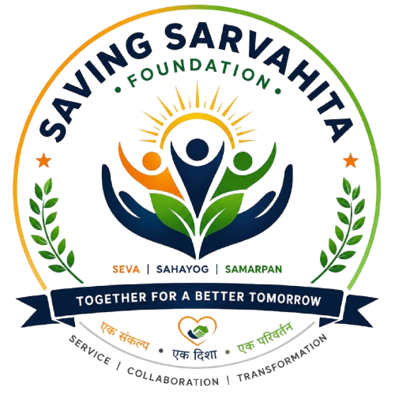

<div align="center">



# SAVING SARVAHITA FOUNDATION

### *Together For A Better Tomorrow*

**एक संकल्प • एक दिशा • एक परिवर्तन**

[](#license)
[](#)
[](#)
[](#)

---

*A newly established Section 8 Non-Profit Organisation registered under the Ministry of Corporate Affairs, Government of India — dedicated to uplifting underprivileged communities through education, healthcare, senior care, animal welfare, and environmental care.*

</div>

---

## 🌟 About Us

**Saving Sarvahita Foundation** is a government-registered NGO (Section 8 Company) based in Mumbai, Maharashtra. We are committed to building a compassionate society by empowering underprivileged lives and creating lasting, transparent impact.

- 🏛️ **MCA Registered** — Certificate of Incorporation under Section 8 of the Companies Act, 2013
- 📋 **NITI Aayog** — Registered on NGO Darpan (Government of India)
- 🪪 **PAN Verified** — Income Tax Department e-PAN Card issued

---

## 🎯 Our Causes

| Cause | Description |
|-------|-------------|
| 📚 **Education** | Supporting children's education through study kits, school supplies, and learning resources |
| 🏥 **Healthcare** | Providing access to medical assistance and health awareness for underserved communities |
| 👴 **Senior Care** | Ensuring dignity and support for elderly individuals in need |
| 🐾 **Animal Welfare** | Protecting and caring for stray and abandoned animals |
| 🌱 **Environment** | Promoting tree plantation drives and environmental sustainability |

---

## 🏗️ Tech Stack

This is a **static website** built with:

| Technology | Purpose |
|------------|---------|
|  | Page structure & semantic markup |
|  | Styling, animations & responsive design |
|  | Interactive components & UX logic |
|  | Icon library |
|  | Typography (Inter, Playfair Display) |

---

## 📁 Project Structure

```
Saving_Sarvahita_Foundation/
├── index.html              # Home page
├── about.html              # About Us, Leadership & Certificates
├── contact.html            # Contact information & form
├── style.css               # Global stylesheet (responsive)
├── script.js               # Interactive functionality
└── assets/
    ├── logo-png.png        # Official foundation logo
    ├── banner.jpg          # Hero banner image
    ├── education.png       # Education cause image
    ├── health.png          # Healthcare cause image
    ├── animal.png          # Animal welfare cause image
    ├── tree.png            # Environment cause image
    ├── Aakash Katti.jpeg   # Founder profile photo
    ├── Vedant Pal.jpeg     # Director profile photo
    ├── QR Sarvahita.jpeg   # UPI donation QR code
    ├── Sarvahita Part B Approval.jpg   # MCA Incorporation Certificate
    ├── Sarvahita Pan.jpg               # Income Tax e-PAN Card
    └── SAVING_SARVAHITA_FOUNDATION-1 Darpan.jpg  # NITI Aayog NGO Darpan
```

---

## 🚀 Pages

### 🏠 Home (`index.html`)
- Hero section with foundation tagline and CTAs
- Our Causes showcase (Education, Healthcare, Senior Care, Animal Welfare, Environment)
- Upcoming Drive / Event details
- Donation modal with UPI QR code
- Volunteer registration modal

### 👥 About Us (`about.html`)
- Foundation mission, vision & values
- Executive Leadership profiles (Founder & Director)
- Government certificates showcase (MCA, PAN, NITI Aayog Darpan)

### 📞 Contact (`contact.html`)
- Contact form
- Office address, phone, email
- Social media links (Facebook, Instagram)

---

## 📱 Responsive Design

The website is fully responsive across all screen sizes:

| Breakpoint | Target |
|------------|--------|
| `> 992px` | Desktop — full navigation with CTA buttons |
| `768px – 992px` | Tablet — compact buttons |
| `< 768px` | Mobile — hamburger menu with slide-down drawer |

---

## 👨‍💼 Executive Leadership

| | Name | Role |
|---|------|------|
| 🏅 | **Aakash Mantappa Katti** | Founder, Chairman & Managing Director |
| 🏅 | **Vedant Sanjeevkumar Pal** | Director & Chief Operating Officer |

---

## 📬 Contact Information

| Channel | Details |
|---------|---------|
| 📍 **Address** | Flat No B 609, VK Lal Vishnu Phase 1, SN Dubey Road, Rawalpada, Dahisar East, Mumbai - 400068, Maharashtra |
| 📞 **Phone** | +91 8828428845 |
| 📧 **Email** | info@savingsarvahita.org |
| 📷 **Instagram** | [@savingsarvahitafoundation](https://www.instagram.com/savingsarvahitafoundation) |

---

## 🛠️ Local Development

To run the website locally:

```bash
# Clone the repository
git clone https://github.com/savingsarvahitafoundation-hub/Saving_Sarvahita_Foundation.git

# Navigate into the project
cd Saving_Sarvahita_Foundation

# Serve with any static server (e.g., VS Code Live Server, Python, Node)
# Python:
python -m http.server 8080

# Then open http://localhost:8080 in your browser
```

---

## 💖 How to Support

- **Donate**: Click the "Donate Now" button on the website to contribute via UPI
- **Volunteer**: Register through the "Volunteer" form on the website
- **Spread the Word**: Share our mission on social media

**UPI ID**: `savingsarvahitafoundation2026@kotak`

---

## 📜 License

© 2026 Saving Sarvahita Foundation. All Rights Reserved.

This website and its content are the property of Saving Sarvahita Foundation. Unauthorized reproduction or distribution is prohibited.

---

<div align="center">

**Built with ❤️ for a better tomorrow**

*Saving Sarvahita Foundation — Seva | Sahayog | Samarpan  -*

</div>
